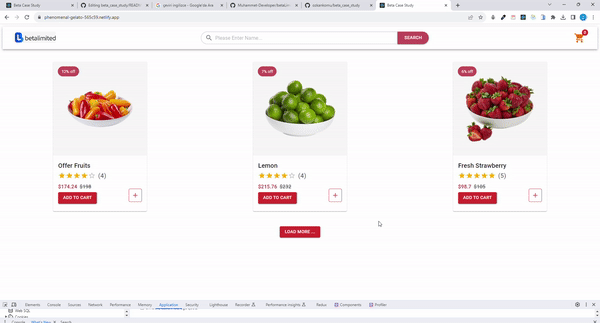

<p align="center">
<a href="https://www.linkedin.com/in/ozkankomu/" target="_blank"></a>
</p>
●	Beta Case Study

## Table of contents

  - [The challenge](#the-challenge)
  - [Screenshot](#screenshot)
  - [Project Skeleton ](#project-skeleton)
  - [Links](#links)
  - [Built with](#built-with)
  - [Installation](#Installation)  
  - [Author](#author)

## The challenge

Hello. I used ReactJs, TypeScript, Redux Toolkit, Redux Persist, Mui, axios technologies in the project.

In its current state, there was no need to use the React Router Dom library in the project, but I added this library so that the project would not lack the structure that a large project should have. I entered the project with the navigation component.

First of all, when the user logs into the project, the Session-Id is checked in the navigation component and if there is no session-Id, the session-Id is first taken and saved to the redux store. I cached the states with redux-persist to prevent the session id from being deleted when logging in or refreshing the page. In the same component, cart information is pulled from the API, saved to the redux store and cached.

When the user adds products from the product cards or increases or decreases the quantity of the product, the basket information is updated and information such as product name, quantity and prices can be seen in the basket. And this information is cached with redux persist.

The user's session id is checked before each request using the axios interceptor and added to the request.

By creating axios instance and axios interceptor in the service helpers folder for API requests, the service folder was kept more organized and understandable.

## Project Skeleton

```
●	Beta Case Study
|
|----readme.md       
SOLUTION
├── public
│     └── index.html
├── src
│    ├── components
│    │       ├── CardList.tsx
│    │       ├── Modal.tsx
│    │       ├── Navbar.tsx
│    │       ├── ProductCard.tsx
│    ├── Services
│    │       ├── Service.Helpers.ts
│    │       ├── Beta.Service.ts│    
│    │      
│    ├── Store
│    │       ├── Cart Slice
│    │       ├── Session Slice   
│    │       
│    ├── Types
│    │       ├── Type.ts
│    │       
│    ├── Views
│    │       ├── HomeView.tsx
│    │   
│    ├── Navigation.tsx
│    │
│    ├── App.js
│    ├── App.css
│    ├── index.js
│    └── index.css
├── package.json
└── yarn.lock
```
## Screenshot
<p align="left">
<a href="https://phenomenal-gelato-565c59.netlify.app"></a>
</p>

## Links
<hr>
<b>Check The Live Website ➡️</b> <a href="https://phenomenal-gelato-565c59.netlify.app"> Live Website </a> 
<hr>

### Built with

- `@ReactJs`
- `@TypeScript`
- `@reduxjs/toolkit`
- `react-redux`
- `redux-Persist`
- `axios`
- `react-router-dom`
- `@mui/material-ui`
- `@emotion/react`


### Installation

1. Clone this project:

   ```bash
     Clone the project: `https://github.com/ozkankomu/beta_case_study`
   ```
2. Install the necessary dependencies:

   ```bash
   npm install / yarn
   ```
## Usage

1. Start the application:

   ```bash
   npm run start / yarn start
   ```
2. Open your web browser and go to [http://localhost:3000/](http://localhost:3000)

## Author

- Author - [Ozkan Komu]

<center> &#8987; Happy Coding  &#9997; </center>
